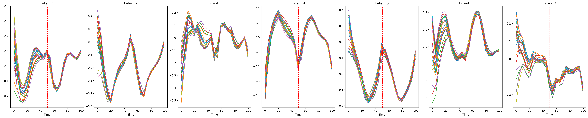

# Spatiotemporal graph neural process for reconstruction, extrapolation, and classification of cardiac trajectories

Official repository for the paper: **Spatiotemporal graph neural process for reconstruction, extrapolation, and classification of cardiac trajectories**

In this work we use spatiotemporal multiplex GNNs + Neural ODEs for cardiac trajectory modeling (reconstruction, extrapolation, and classification). The repository includes model code, training pipelines, Optuna hyperparameter tuning, and synthetic/cardiac experiments.

<p align="center">
  
</p>

<p align="center">
  
</p>

<p align="center">
  
</p>

<p align="center">
  
</p>


## Highlights
- **Graph-latent Neural ODE** with **multiplex** (space/time) message passing.
- Handles **sparse context** observations; predicts **continuous-time** trajectories.
- Works on **synthetic** (Lorenz / Pendulum / Kuramoto) and **cardiac** datasets (ACDC, UKB).
- Includes baselines for classification (Sklearn) and forecasting (ARIMA).
- Reproducible configs & Docker.

---

## Installation

### CPU-only

```bash
python -m venv .venv
source .venv/bin/activate   # Windows: .venv\Scripts\activate
python -m pip install --upgrade pip

# Runtime only
pip install .

# Or, if you also want linters/tests (ruff, black, pytest, etc.)
pip install ".[dev]"
```

Quick check:
```bash
python - <<'PY'
import torch, dgl, torch_geometric
print("Torch:", torch.__version__, "CUDA?", torch.cuda.is_available())
print("DGL:", dgl.__version__)
print("PyG:", torch_geometric.__version__)
PY
```

### GPU - CUDA 12.1

```bash
python -m venv .venv
source .venv/bin/activate
python -m pip install --upgrade pip

# This uses your pinned CUDA 12.1 wheels for torch/vision/audio and the matching DGL wheel.
pip install ".[gpu]"
```

Verify

```bash
python - <<'PY'
import torch, dgl
print("Torch:", torch.__version__)
print("CUDA available?", torch.cuda.is_available())
if torch.cuda.is_available():
    print("Device:", torch.cuda.get_device_name(0))
print("DGL:", dgl.__version__)
PY
```

---

## Model Structure

- **Core model**: `model/stgnp.py`
- **Encoder/decoder**: `model/encoder_decoder.py`
- **ODE + multiplex GCN**: `model/mpgcn.py`
- **Training loop**: `utils/train_loop.py`
- **Loss functions**: `utils/losses.py`

Hyperparameter optimization is done with Optuna.  
- Main objective: `model/train_stgnp.py`  
- Synthetic objective: `synthetic_data/train_synthetic_models.py`

---

## Optuna

- The Optuna study is stored in a **Postgres database**.  
- Scripts are provided to retrieve results and store them locally.

To use the scripts of Optuna, fill the "dev.env.example" and rename it to "dev.env" . 

---

## Data Structure

Experiments expect three input files:
- **Nodes data**: e.g., regional volumes  

Cycle', 'Region', 'Volume_Index', 'Subject',
       'Region_ID', 'Cycle_ID', 'Label', 'Label_ID'  'Subject'

- **Edges data**: e.g., Wasserstein distances  

Index(['Source', 'Target', 'Cycle_1', 'Cycle_2', 'Edge_Type', 'CM_L2_Distance',
       'Wasserstein_Distance', 'Subject', 'Cycle_1_ID', 'Cycle_2_ID',
       'Target_ID', 'Source_ID', 'TargetLabel', 'SourceLabel',
       'TargetLabel_ID', 'SourceLabel_ID'],
      dtype='object', name='Metric')

- **Global data**: e.g., BMI, demographics  

 'Subject', BMI, Age...

---

## Synthetic Baselines

Synthetic datasets generate nodes and edges (global data not used).

To run experiments with default settings:

```bash
python -m synthetic_data/pendulum.py
python -m synthetic_data/lorenz_model.py
python -m synthetic_data/kuramoto.py
```

---

## Cardiac data

The ACDC data can be download in: https://www.creatis.insa-lyon.fr/Challenge/acdc/ . The UKB data can be requested at: https://www.ukbiobank.ac.uk/
Cardiac data can be processed using the pipeline available in [Github available soon]. 

Run experiments
ACDC:
Cross-validation: 'experiments/ACDC_CV.py' 
Best config: 'experiments/ACDC_RunBest.py'

UKB:
Cross-validation: 'experiments/UKB_CV.py' 
Best config: 'experiments/UKB_RunBest.py'

---

## Baselines

### Classification

Baseline for classification are available for ACDC and UKB , using XGBoost, RandomForest and kNN. 

'baselines/Sklearn/ACDC_baselines_sklearn.py'
'baselines/Sklearn/UKB_baselines_sklearn.py'

### ARIMA forecasting

Located in: 'baselines/SyntheticForecasting'

⚠️ Requires a separate environment:

This submodule is intended to run in a separate Python environment from the main
project. It only requires a small set of packages and avoids the GPU/graph stack
used by the main code.

Recommended setup (Python 3.10):

```bash
cd baselines/SyntheticForecasting
python -m venv .venv && source .venv/bin/activate
pip install --upgrade pip
pip install -r requirements.txt
```

---
## Experiment configurations

JSON configs are stored in the configs/ folder. On HPC use the scripts in the hpc/ folder to load them automatically.

---
## Docker

The project includes a Dockerfile. If you want to re-build the docker can use the script 'build_docker.sh' or 'build_docker_cpu.sh' for the CPU version, both changing the paths. 

---
## Pretrained weights

Download from the [Releases](https://github.com/jbanusco/STGNP/releases/v0.1.0).

Direct links:
- ACDC (Full): `stgnp_acdc_full.pt`
- ACDC (Anat): `stgnp_acdc_anat.pt`
- UKB (Full): `stgnp_ukb_full.pt`
- UKB (Anat): `stgnp_ukb_anat.pt`
- Synthetic: `stgnp_pendulum.pt`, `stgnp_lorenz.pt`, `stgnp_kuramoto.pt`


---
## Citation
If you use or refer to this work please cite [to add]